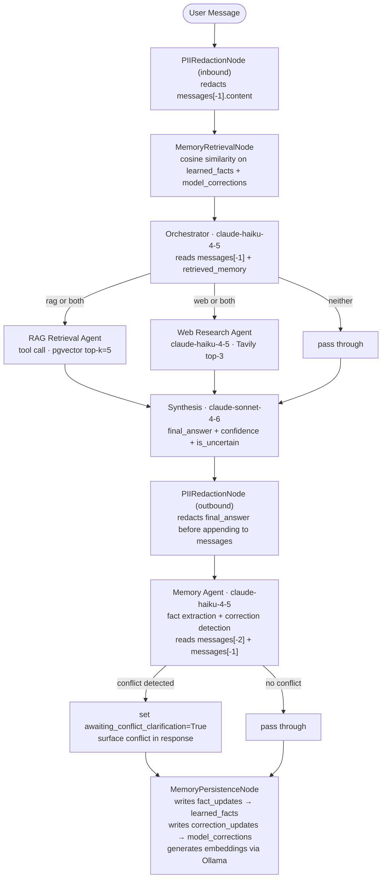
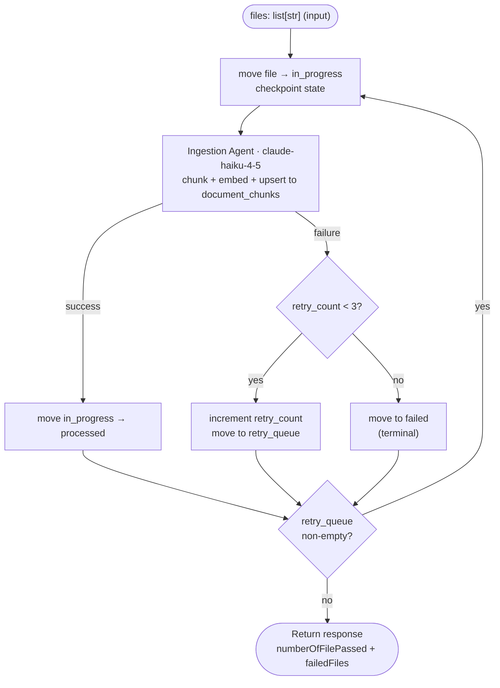
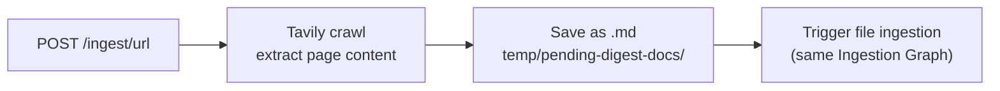

# Project Requirement Document — Second Brain

**Date:** 2026-06-16  
**Status:** Approved  
**Full design spec:** [`docs/superpowers/specs/2026-06-16-second-brain-design.md`](./superpowers/specs/2026-06-16-second-brain-design.md)

---

## 1. Overview

Build a personal "Second Brain" knowledge management system for mixed personal and work use. The system ingests content from local markdown files and web URLs, stores it for semantic retrieval, and maintains persistent memory of conversations and learned facts. The system must demonstrate measurable improvement over a no-RAG baseline through rigorous evaluation.

---

## 2. Tech Stack Decisions

| Component            | Decision                          | Rationale                                                                                         |
| -------------------- | --------------------------------- | ------------------------------------------------------------------------------------------------- |
| Language             | Python                            | Required by assignment                                                                            |
| Web framework        | FastAPI                           | Lightweight, async-native, integrates cleanly with SQLModel                                       |
| Agent orchestration  | LangGraph                         | Required by assignment                                                                            |
| Database             | PostgreSQL + pgvector             | Required by assignment; pgvector for semantic search                                              |
| ORM + migrations     | SQLModel + Alembic                | SQLModel reduces boilerplate — DB models double as FastAPI schemas; Alembic for schema migrations |
| Observability        | Arize Phoenix (OTEL)              | Required by assignment                                                                            |
| Embedding model      | `qwen3-embedding:0.6b` via Ollama | Fully local, no API cost, dim=1024                                                                |
| LLM — lightweight    | `claude-haiku-4-5`                | Fast/cheap for routing, web research, memory extraction                                           |
| LLM — synthesis/eval | `claude-sonnet-4-6`               | Higher quality for final answers and LLM-as-judge evals                                           |
| LLM provider         | Claude only (no Gemini)           | Decided to use Anthropic models exclusively for this project                                      |
| Web search/crawl     | Tavily SDK                        | Required by assignment                                                                            |
| Containerisation     | Docker Compose                    | Required by assignment                                                                            |

---

## 3. API Design Decisions

### Endpoints

| Endpoint       | Method | Description                                                     |
| -------------- | ------ | --------------------------------------------------------------- |
| `/query`       | POST   | Chat with the Second Brain                                      |
| `/ingest/file` | POST   | Process pending markdown files from `temp/pending-digest-docs/` |
| `/ingest/url`  | POST   | Receive URL(s), crawl via Tavily, ingest as markdown            |

### `/query` Contract

```json
// Request
{ "message": "string", "sessionId": "UUID7 or null" }

// Response
{
  "answer": "string",
  "sessionId": "UUID7",
  "confidence": 0.85,
  "isUncertain": false,
  "conflictDetected": false,
  "conflictContext": []
}
```

- `sessionId` is `null` for a new conversation; a UUID7 continues an existing session
- `sessionId` is the LangGraph `threadId` and the chat history key (stored in Postgres)
- `isUncertain` is `true` when confidence < 0.7; prompts the user to optionally correct the answer
- `conflictDetected` is `true` when a newly extracted fact conflicts with an existing memory

### `/ingest/file` Response

```json
{
  "numberOfFilePassed": 9,
  "failedFiles": ["file-name-6.md", "file-name-9.md"]
}
```

- Each file is retried up to 3 times on failure
- Files exhausting all retries are moved to `temp/failed/`

---

## 4. Architecture Decisions

### Multi-Agent Pattern

**Decision: Single Supervisor Graph (LangGraph)**

The Orchestrator is an LLM-powered node (not rule-based) that reads the user query and memory context, then decides routing. RAG Retrieval and Web Research fan out in parallel via LangGraph's `Send` API when both are needed.

Rejected:

- Hierarchical multi-graph: added indirection without benefit at this scope
- Agent-as-tool (ReAct): harder to enforce fan-out parallelism and guaranteed synthesis step

### Two Separate LangGraph Graphs

- **Query Graph** (`SecondBrainState`) — serves `POST /query`
- **Ingestion Graph** (`IngestionState`) — serves `POST /ingest/file` and `POST /ingest/url`

They share no runtime state; separating them keeps state schemas clean.

### Docker Network Isolation

```
app_network:      [backend, app_postgres]
phoenix_network:  [phoenix, phoenix_postgres]
```

The backend never joins `phoenix_network`. OTEL traces are exported to Phoenix via host gRPC port 4317. This ensures the backend cannot directly access Phoenix's database — a deliberate security boundary that must be maintained in production.

> **Linux note:** Requires `extra_hosts: ["host.docker.internal:host-gateway"]` on the backend service for host-port access on Linux Docker hosts.

---

## 5. Query Graph — Agent Design

### Flow



### Agent Roles

| Agent                      | Model               | Responsibility                                                                                                             |
| -------------------------- | ------------------- | -------------------------------------------------------------------------------------------------------------------------- |
| **PIIRedactionNode (in)**  | rule-based          | Redacts PII from inbound message before any LLM sees it                                                                    |
| **MemoryRetrievalNode**    | tool call           | Cosine similarity search on `learned_facts` + `model_corrections`; populates `retrieved_memory`                            |
| **Orchestrator**           | `claude-haiku-4-5`  | LLM-driven routing: `rag` / `web` / `both` / `neither`; uses `Send` for fan-out                                            |
| **RAG Retrieval**          | tool call           | Embeds query via Ollama, pgvector top-k=5                                                                                  |
| **Web Research**           | `claude-haiku-4-5`  | Tavily search, top-3 results, rate-limited                                                                                 |
| **Synthesis**              | `claude-sonnet-4-6` | Final answer from all context; confidence score; `neither` routing has confidence floor 0.5                                |
| **PIIRedactionNode (out)** | rule-based          | Redacts PII from `final_answer` before it enters chat history                                                              |
| **Memory Agent**           | `claude-haiku-4-5`  | Extracts facts; detects corrections; manages `awaiting_correction` and `awaiting_conflict_clarification` state transitions |
| **MemoryPersistenceNode**  | tool call           | Writes `fact_updates` → `learned_facts`; `correction_updates` → `model_corrections`; generates embeddings                  |
| **Ingestion Agent**        | `claude-haiku-4-5`  | Chunks docs, generates contextual headers, embeds, upserts to `document_chunks`                                            |

### LangGraph State

```python
class RagResult(TypedDict):
    content: str
    score: float
    chunk_index: int
    metadata: dict

class WebResult(TypedDict):
    title: str
    url: str
    content: str

class MemoryItem(TypedDict):
    id: str
    fact: str
    confidence: float
    type: Literal["learned_fact", "model_correction"]

class FactUpdate(TypedDict):
    fact: str
    confidence: float
    conflicts_with: list[str]       # IDs of conflicting existing facts

class CorrectionUpdate(TypedDict):
    original_answer: str            # from messages[-2]
    correction: str
    root_cause: str

class SecondBrainState(TypedDict):
    session_id: str
    messages: list[BaseMessage]     # trimmed view for LLMs; full history in checkpoint
    rag_results: list[RagResult]
    web_results: list[WebResult]
    retrieved_memory: list[MemoryItem]
    routing_decision: Literal["rag", "web", "both", "neither"]
    final_answer: str
    confidence: float
    is_uncertain: bool
    awaiting_correction: bool       # persisted across turns via LangGraph checkpointing
    awaiting_conflict_clarification: bool
    conflict_context: list[str]
    fact_updates: list[FactUpdate]
    correction_updates: list[CorrectionUpdate]
```

---

## 6. Ingestion Graph Design

### Flow



### URL Ingestion Flow



### Ingestion State

```python
class FailedFile(TypedDict):
    filename: str
    error: str
    retry_count: int

class IngestionState(TypedDict):
    files: list[str]                # original input queue
    in_progress: list[str]          # crash-safe in-flight tracking
    processed: list[str]            # successfully ingested filenames
    retry_queue: list[FailedFile]   # retry_count < 3
    failed: list[FailedFile]        # terminal failures: retry_count >= 3
```

### File Folder Structure

```
temp/
  pending-digest-docs/   ← drop files here to ingest
  processed/             ← moved here after successful ingestion
  failed/                ← moved here after 3 retries exhausted
```

### Document Deduplication

Content hash (MD5) stored in `ingested_documents`. Files with a matching hash are skipped on re-ingestion.

---

## 7. Document Chunking Decisions

**Strategy: Hybrid** — split on structural boundaries first, then apply token cap.

**Split order:** markdown headings (H1/H2/H3) → blank lines → sentence boundaries

| Content Type              | Target     | Max         | Overlap   |
| ------------------------- | ---------- | ----------- | --------- |
| Markdown articles / notes | 512 tokens | 1024 tokens | 64 tokens |
| Meeting transcriptions    | 256 tokens | 512 tokens  | 0         |
| Code fences               | atomic     | —           | —         |

**Contextual retrieval headers:** each chunk gets a 50–100 token LLM-generated context header prepended before embedding (e.g., "This chunk is from [doc title], section [H1 > H2], covering [topic]."). Based on Anthropic research showing 49–67% retrieval failure rate reduction.

**Header metadata:** H1 > H2 > H3 hierarchy stored as chunk metadata for filtered retrieval at query time.

---

## 8. Memory System Decisions

### Learned Facts

- Auto-extracted from every message when the user refers to themselves
- Embedded via Ollama before storing (semantic retrieval at query time)
- Conflict detection via cosine similarity against existing facts before storing
- If conflict: surface to user, wait for clarification, then add/modify/remove

### Model Corrections

- Synthesis flags `is_uncertain=True` when `confidence < 0.7`
- `awaiting_correction` persists across turns via LangGraph checkpointing
- User corrects in the chat; Memory Agent detects correction, extracts root cause, stores
- If user does NOT correct (sends a new query instead): `awaiting_correction` resets to `False`

### Memory Retrieval

- Both `learned_facts` and `model_corrections` tables have `VECTOR(1024)` embedding columns
- `MemoryRetrievalNode` runs cosine similarity search at the start of every query
- `model_corrections.embedding` encodes the `correction` field (not `original_answer`)

---

## 9. PII Guardrail Decisions

**Scope:** broad — names, emails, phones, physical addresses, national IDs, financial data, medical terms

**Action:** redact with typed placeholders — `[NAME]`, `[EMAIL]`, `[PHONE]`, `[ADDRESS]`, `[ID]`, `[CARD]`, `[MEDICAL]`

**Applied at two points:**

1. Inbound: `messages[-1].content` before any LLM node
2. Outbound: `final_answer` before it is appended to `messages` and persisted to `chat_history`

---

## 10. Database Schema

```sql
-- LangGraph session state
chat_history
  session_id    UUID7        PK
  thread_data   JSONB
  created_at    TIMESTAMP
  updated_at    TIMESTAMP

-- RAG document store
document_chunks
  id            UUID         PK
  doc_id        UUID         FK → ingested_documents.id
  content       TEXT         -- chunk text with contextual header prepended
  embedding     VECTOR(1024)
  chunk_index   INT
  metadata      JSONB        -- {source, heading_path, content_type, char_count}
  created_at    TIMESTAMP

-- Ingestion deduplication
ingested_documents
  id            UUID         PK
  filename      TEXT
  source_url    TEXT         -- null for local files
  content_hash  TEXT         -- MD5
  status        TEXT         -- 'processed' | 'failed'
  ingested_at   TIMESTAMP

-- Long-term memory: learned facts
learned_facts
  id            UUID         PK
  fact          TEXT         -- PII-scrubbed
  embedding     VECTOR(1024)
  source_session UUID7       FK → chat_history.session_id
  confidence    FLOAT
  created_at    TIMESTAMP
  updated_at    TIMESTAMP

-- Long-term memory: model corrections
model_corrections
  id            UUID         PK
  original_answer TEXT
  correction    TEXT
  root_cause    TEXT
  embedding     VECTOR(1024) -- encodes `correction` field
  source_session UUID7       FK → chat_history.session_id
  created_at    TIMESTAMP
```

**ORM:** SQLModel + Alembic. SQLModel models serve as both DB table definitions and FastAPI schemas. pgvector via `pgvector-python`.

---

## 11. Observability Decisions

Full distributed tracing at three levels per `/query` request:

- **LLM call level** — every prompt/completion, token counts, latency
- **Agent/node level** — which agents ran, order, duration, routing decision taken
- **Request level** — end-to-end trace from HTTP request to final response

Phoenix stores trace data in `phoenix_postgres` (only accessible within `phoenix_network`). Backend exports via OTEL gRPC to Phoenix on host port 4317 — backend never joins `phoenix_network`.

---

## 12. Evaluation Decisions

### Dataset

Hybrid: Claude generates ~100 Q&A pairs from ingested documents; user curates to ~30–50. Each pair: question + expected answer + expected source chunks.

### Metrics

| Layer     | Metric                                | Tool                                 |
| --------- | ------------------------------------- | ------------------------------------ |
| Retrieval | `context_precision`, `context_recall` | RAGAS                                |
| Answer    | `faithfulness`, `answer_relevancy`    | RAGAS + `claude-sonnet-4-6` as judge |

### Baseline

Same questions through: (1) no-RAG (Claude only, no retrieval) and (2) full RAG pipeline. RAGAS metrics must show measurable improvement of RAG over baseline.

### When

Offline / on-demand script. Not part of CI.

### Confidence Threshold

Starting value: `confidence < 0.7` → `is_uncertain=True`. Calibrate during eval by measuring precision/recall of uncertainty flags against human-labelled ground truth.

---

## 13. Acceptance Criteria

| #     | Criterion                                                                                                                                 |
| ----- | ----------------------------------------------------------------------------------------------------------------------------------------- |
| AC-1  | After a turn that extracts a user fact, `learned_facts` table contains that fact with a valid embedding                                   |
| AC-2  | If a fact conflicts with existing memory, the API response includes a conflict notification and `awaiting_conflict_clarification=True`    |
| AC-3  | Given `awaiting_correction=True`, sending an unrelated query resets `awaiting_correction=False`                                           |
| AC-4  | Given `awaiting_correction=True` and a user correction, `model_corrections` table contains root cause + correction with a valid embedding |
| AC-5  | PII in user messages is redacted before reaching any LLM node                                                                             |
| AC-6  | PII in `final_answer` is redacted before being persisted to `chat_history`                                                                |
| AC-7  | A file that fails ingestion is retried up to 3 times; on 3rd failure it moves to `temp/failed/`                                           |
| AC-8  | A file matching an existing `content_hash` in `ingested_documents` is skipped on re-ingestion                                             |
| AC-9  | RAGAS `context_recall` and `answer_faithfulness` for the full pipeline are measurably higher than the no-RAG baseline                     |
| AC-10 | `sessionId=null` creates a new LangGraph thread; subsequent requests with the returned UUID7 continue that thread                         |
