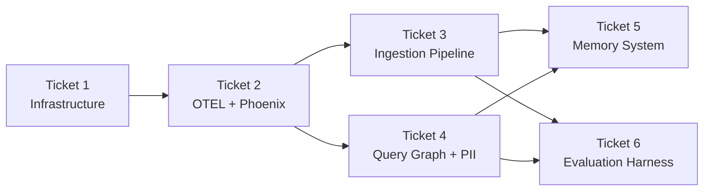

# Implementation Plan — Second Brain

**Date:** 2026-06-16  
**PRD:** [docs/002-project-requirement-document.md](../002-project-requirement-document.md)  
**Design Spec:** [docs/superpowers/specs/2026-06-16-second-brain-design.md](../superpowers/specs/2026-06-16-second-brain-design.md)

---

## Implementation Sequence

Each ticket produces independently testable, working software. OTEL is implemented before ingestion so every agent and endpoint is observable from day one.

---

## Tickets

### Ticket 1 — Infrastructure & Project Foundation

**Plan:** [2026-06-16-ticket-1-infrastructure.md](../superpowers/plans/2026-06-16-ticket-1-infrastructure.md)

Set up the complete project foundation before any feature code is written.

| | |
|---|---|
| **Goal** | Docker services running, all 5 DB tables created, `GET /health` returns 200, Alembic migrations run cleanly |
| **Tasks** | 6 tasks (~40 steps) |
| **Key deliverables** | `docker-compose.yml` (app_postgres, phoenix_postgres, phoenix, backend), all SQLModel models (`ChatHistory`, `IngestedDocument`, `DocumentChunk`, `LearnedFact`, `ModelCorrection`), Alembic initial migration, FastAPI skeleton |
| **Notable** | `DocumentChunk.metadata` is `chunk_metadata` in Python (SQL column stays `metadata`) to avoid SQLAlchemy name conflict |

---

### Ticket 2 — OTEL + Arize Phoenix

**Plan:** [2026-06-16-ticket-2-otel-phoenix.md](../superpowers/plans/2026-06-16-ticket-2-otel-phoenix.md)

Instrument the app before building features so every subsequent endpoint and LangGraph node is traceable from day one.

| | |
|---|---|
| **Goal** | A single `GET /health` request produces a visible end-to-end trace in Phoenix UI at `http://localhost:6006` |
| **Tasks** | 5 tasks |
| **Key deliverables** | `observability/tracing.py` with `setup_tracing()` + `@trace_node` decorator, FastAPI auto-instrumentation, `extra_hosts` for Linux Docker compatibility |
| **Notable** | Backend reaches Phoenix via host port 6006 only — networks remain isolated; Phoenix network is never accessible to the backend container |

---

### Ticket 3 — Document Ingestion Pipeline

**Plan:** [2026-06-16-ticket-3-ingestion.md](../superpowers/plans/2026-06-16-ticket-3-ingestion.md)

Build the full ingestion flow from raw markdown to searchable pgvector chunks.

| | |
|---|---|
| **Goal** | Dropping a `.md` into `temp/pending-digest-docs/` and calling `POST /ingest/file` stores embedded chunks in pgvector; file moves to `temp/processed/` |
| **Tasks** | 10 tasks |
| **Key deliverables** | `services/chunking.py` (hybrid: article/transcription/code-fence), `services/embeddings.py` (Ollama `qwen3-embedding:0.6b`), `services/tavily.py`, `IngestionState` + LangGraph ingestion graph with `in_progress`/`retry_queue`, `POST /ingest/file` + `POST /ingest/url` endpoints |
| **Notable** | 3 retry attempts per file; code fences are protected via placeholder substitution before any split |

---

### Ticket 4 — Query Graph + PII Guardrail

**Plan:** [2026-06-16-ticket-4-query-graph.md](../superpowers/plans/2026-06-16-ticket-4-query-graph.md)

Build the core `/query` flow with all retrieval agents, PII protection on both edges, and session continuity.

| | |
|---|---|
| **Goal** | `POST /query` returns a grounded answer, PII is redacted inbound and outbound, sessions continue across calls via UUID7 thread IDs |
| **Tasks** | 12 tasks |
| **Key deliverables** | `services/pii.py` (Presidio broad-scope), `PIIRedactionNode` (inbound + outbound), `Orchestrator` (LLM routing), `RAGRetrievalNode`, `WebResearchNode` (Tavily), `SynthesisNode` (confidence scoring), `SecondBrainState`, LangGraph query graph with `Send` fan-out + `AsyncPostgresSaver` checkpointing |
| **Notable** | `MemoryRetrievalNode` is a stub (empty list) in this ticket — fully wired in Ticket 5 |

---

### Ticket 5 — Memory System

**Plan:** [2026-06-16-ticket-5-memory.md](../superpowers/plans/2026-06-16-ticket-5-memory.md)

Add persistent cross-session memory: auto fact extraction, conflict detection, and model correction learning.

| | |
|---|---|
| **Goal** | AC-1 through AC-4 all pass: facts persist with embeddings, conflicts surface to user, `awaiting_correction` state machine works across turns |
| **Tasks** | 8 tasks |
| **Key deliverables** | `MemoryRetrievalNode` (full implementation replacing stub), `MemoryAgentNode` (3 cases: fact extraction, correction detection, conflict resolution), `MemoryPersistenceNode` (DB writes + embeddings), updated query graph |
| **Notable** | `ModelCorrection.embedding` encodes the `correction` field, not `original_answer` — so retrieval surfaces the *correct* answer, not the mistake |

---

### Ticket 6 — Evaluation Harness

**Plan:** [2026-06-16-ticket-6-evaluation.md](../superpowers/plans/2026-06-16-ticket-6-evaluation.md)

Build offline eval tooling to prove RAG improves over a no-RAG baseline.

| | |
|---|---|
| **Goal** | `python eval/run_eval.py` produces a report showing RAGAS `context_recall` and `answer_faithfulness` are measurably higher for RAG than no-RAG baseline (AC-9) |
| **Tasks** | 7 tasks |
| **Key deliverables** | `eval/generate_dataset.py` (Claude generates ~100 Q&A pairs), `eval/baseline.py` (direct Claude, no retrieval), `eval/run_eval.py` (full RAGAS: `context_recall`, `context_precision`, `faithfulness`, `answer_relevancy`), `eval/compare.py` (markdown report with delta column) |
| **Notable** | Run offline on demand — not part of CI. User manually curates generated pairs to ~30–50 before running eval |

---

## Acceptance Criteria Coverage

| AC | Covered in |
|---|---|
| AC-1: Extracted facts persisted with embedding | Ticket 5 |
| AC-2: Conflict detected → notification + flag | Ticket 5 |
| AC-3: `awaiting_correction` resets on non-correction | Ticket 5 |
| AC-4: Corrections persisted with root cause + embedding | Ticket 5 |
| AC-5: User message PII redacted before LLM | Ticket 4 |
| AC-6: `final_answer` PII redacted before chat history | Ticket 4 |
| AC-7: File retried 3× then moved to `temp/failed/` | Ticket 3 |
| AC-8: Duplicate file (matching hash) skipped | Ticket 3 |
| AC-9: RAG RAGAS metrics > no-RAG baseline | Ticket 6 |
| AC-10: `sessionId=null` creates thread; UUID7 continues it | Ticket 4 |
