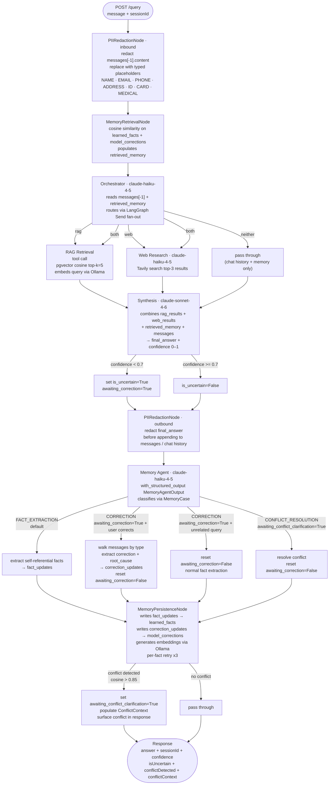
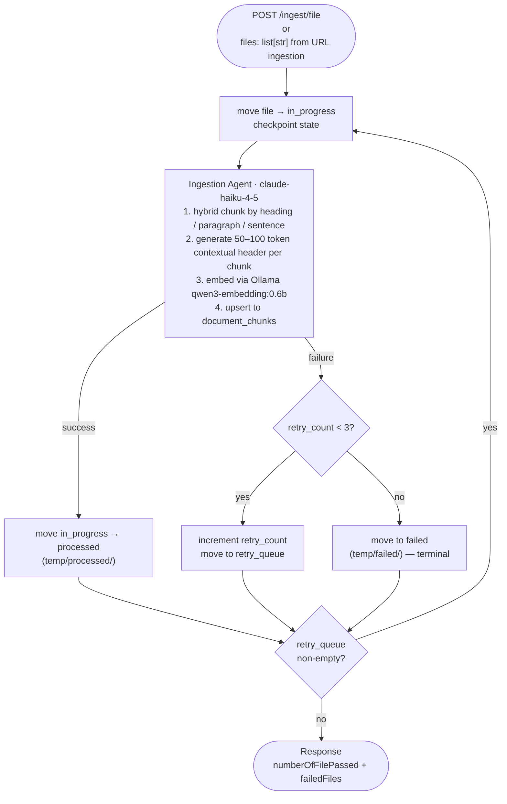
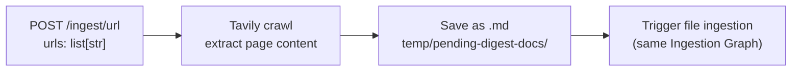
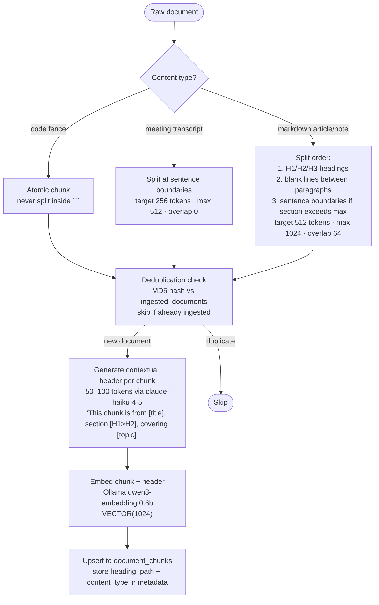
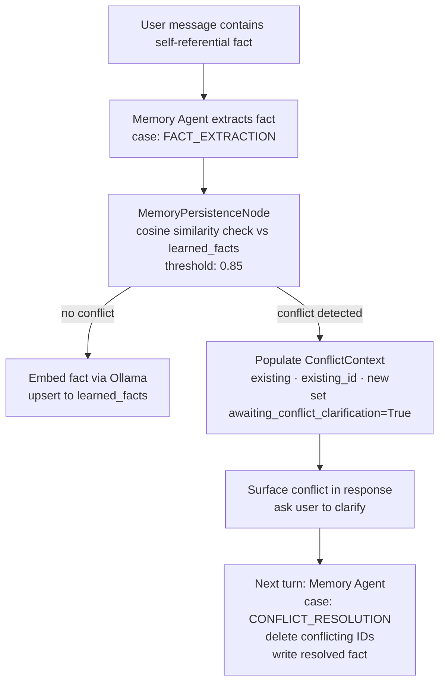
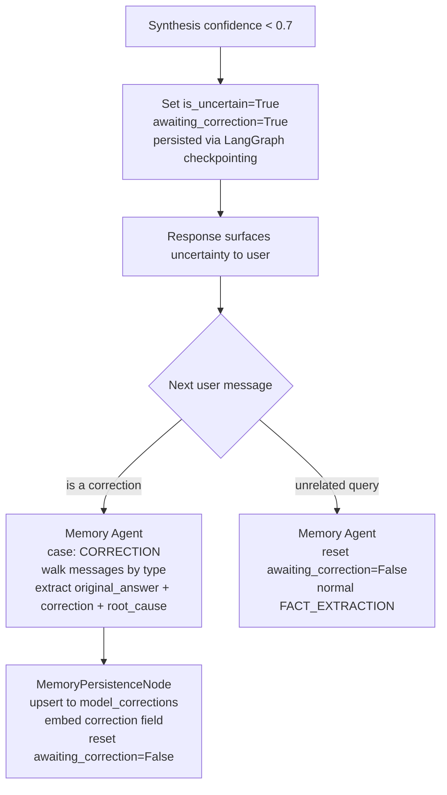

# Workflow Design

## Two Independent Graphs

The system has two LangGraph graphs that share the database but never share runtime state:

| Graph | Trigger | State |
|-------|---------|-------|
| **Query Graph** | `POST /query` | `SecondBrainState` |
| **Ingestion Graph** | `POST /ingest/file`, `POST /ingest/url` | `IngestionState` |

---

## 1. User Query Workflow

### Flow



### Agent Responsibilities

| Agent | Model | Responsibility |
|-------|-------|----------------|
| PIIRedactionNode (in) | rule-based | Redact PII from `messages[-1]` before any LLM sees it |
| MemoryRetrievalNode | tool call | Cosine similarity on `learned_facts` + `model_corrections`, populates `retrieved_memory` |
| Orchestrator | `claude-haiku-4-5` | Route to `rag` / `web` / `both` / `neither` using LangGraph `Send` for fan-out |
| RAG Retrieval | tool call | Embed query via Ollama, pgvector top-k=5 from `document_chunks` |
| Web Research | `claude-haiku-4-5` | Tavily search, top-3 results |
| Synthesis | `claude-sonnet-4-6` | Produce `final_answer` + `confidence`. Sets `is_uncertain=True` + `awaiting_correction=True` when `confidence < 0.7` |
| PIIRedactionNode (out) | rule-based | Redact `final_answer` before persisting to chat history |
| Memory Agent | `claude-haiku-4-5` | Classify turn as `FACT_EXTRACTION` / `CORRECTION` / `CONFLICT_RESOLUTION`, output structured `MemoryAgentOutput` |
| MemoryPersistenceNode | tool call | Write facts + corrections with embeddings; conflict-check via cosine similarity (threshold 0.85) |

### State Flag Invariants

`awaiting_correction` and `awaiting_conflict_clarification` are **mutually exclusive**. Entering `CONFLICT_RESOLUTION` always resets `awaiting_correction=False`.

Session continuity: `sessionId` is the LangGraph `threadId`. `null` = new thread; returning UUID7 continues the same thread via `AsyncPostgresSaver` checkpointing.

---

## 2. Data Ingestion Workflow

### File Ingestion Flow



### URL Ingestion Flow



### Document Chunking Strategy



### File Folder Structure

```
temp/
  pending-digest-docs/   ← drop .md files here; POST /ingest/file reads from here
  processed/             ← moved here after successful ingestion
  failed/                ← moved here after 3 retries exhausted
```

---

## 3. Memory System Workflow

### Fact Lifecycle



### Correction Lifecycle


