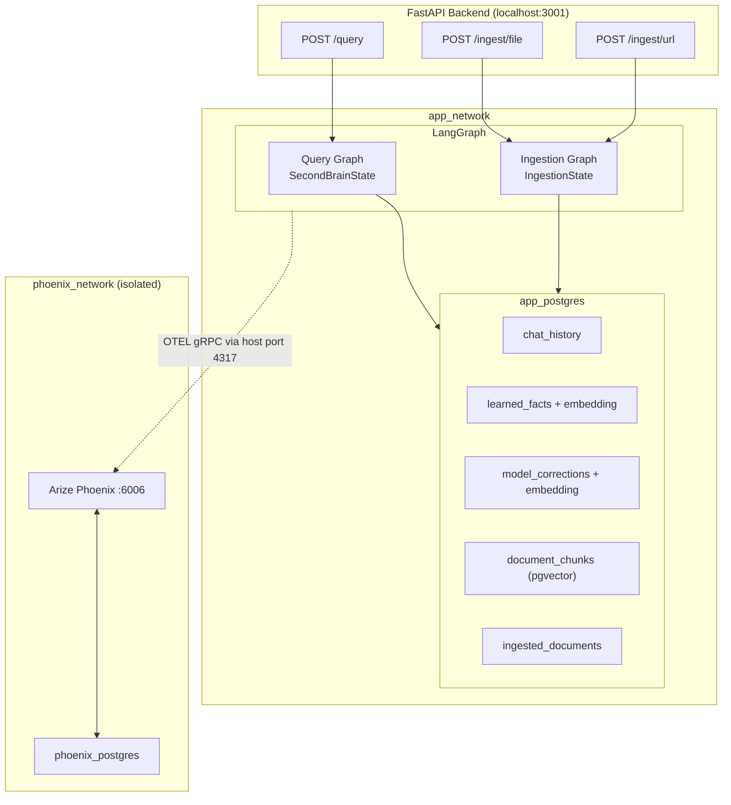
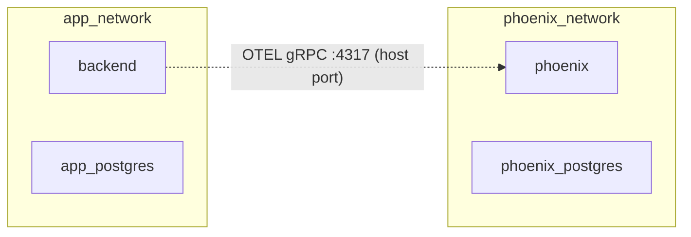
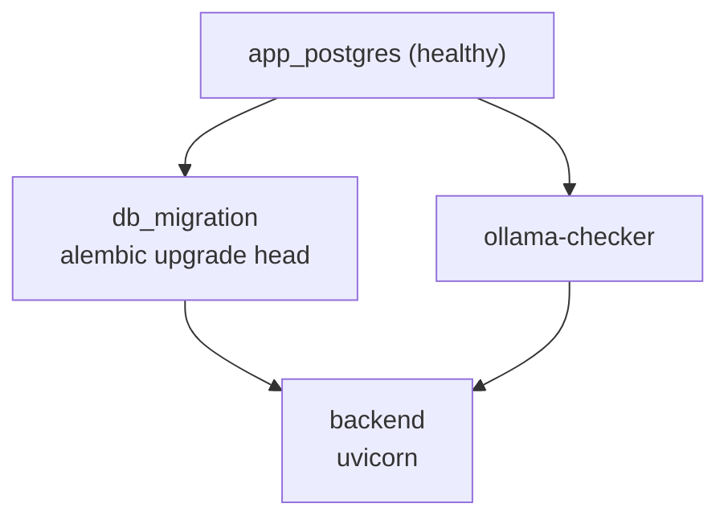

# System Architecture

## Overview

A personal "Second Brain" knowledge management system built with FastAPI, LangGraph multi-agent orchestration, PostgreSQL + pgvector, and Arize Phoenix for observability. Two independent LangGraph graphs handle queries and ingestion; they share the same database but never share runtime state.

---

## Tech Stack

| Component            | Technology                                                    |
| -------------------- | ------------------------------------------------------------- |
| Language             | Python 3.13                                                   |
| Web framework        | FastAPI                                                       |
| Agent orchestration  | LangGraph                                                     |
| Database             | PostgreSQL + pgvector (Docker)                                |
| ORM + migrations     | SQLModel + Alembic                                            |
| Observability        | Arize Phoenix (OTEL)                                          |
| Embedding model      | `qwen3-embedding:0.6b` via Ollama (localhost:11434, dim=1024) |
| LLM — lightweight    | `claude-haiku-4-5`                                            |
| LLM — synthesis/eval | `claude-sonnet-4-6`                                           |
| Web search/crawl     | Tavily SDK                                                    |
| Containerisation     | Docker Compose                                                |

---

## High-Level Architecture



---

## Docker Networks

Two fully isolated networks. The backend never joins `phoenix_network` — traces reach Phoenix only via gRPC on the host port.



> **Linux note:** Requires `extra_hosts: ["host.docker.internal:host-gateway"]` on `backend` service. Docker Desktop (Mac/Windows) provides this automatically.

### Container Startup Order



`db_migration` is a one-shot container that reuses the backend image, runs `alembic upgrade head`, and exits. Backend only starts after both `db_migration` and `ollama-checker` complete successfully.

---

## Connection Pool Architecture

Two distinct DB pools coexist — they cannot be shared (different drivers):

| Pool                  | Driver   | Used by                                                         |
| --------------------- | -------- | --------------------------------------------------------------- |
| `asyncpg.Pool`        | asyncpg  | `rag_retrieval.py`, `memory_retrieval_node` — pgvector queries  |
| `AsyncConnectionPool` | psycopg3 | `query_graph.py` — LangGraph `AsyncPostgresSaver` checkpointing |

`db/pool.py` is the shared asyncpg pool singleton (`get_pgvector_pool()`). The psycopg3 pool must be constructed with `autocommit=True` so LangGraph's `CREATE INDEX CONCURRENTLY` runs outside a transaction block.

---

## Database Schema

See [004-database.md](./004-database.md) for the full schema, ER diagram, and DB access strategy.

---

## Workspace Structure

```
ai-learning-milestone/          (workspace root)
  pyproject.toml                ← [tool.uv.workspace] only
  uv.lock                       ← shared lock file
  ruff.toml                     ← shared lint/format config
  .venv/                        ← shared workspace venv
  apps/
    backend/
      pyproject.toml            ← backend dependencies
      pytest.ini                ← backend test config (pythonpath = src)
      src/second_brain/         ← application source
      tests/                    ← unit + integration tests
      alembic/                  ← DB migrations
      alembic.ini
    eval/
      pyproject.toml            ← ragas + eval deps
      generate_dataset.py
      run_eval.py
      compare.py
  docker/
    Dockerfile.backend          ← backend image (context: apps/backend/)
    ollama-checker.sh
  docker-compose.yml
  Justfile
```

---

## Observability

Full distributed tracing via OTEL → Arize Phoenix at three levels per `/query`:

| Level      | What is traced                                      |
| ---------- | --------------------------------------------------- |
| LLM call   | Every prompt/completion, token counts, latency      |
| Agent/node | Which agents ran, order, duration, routing decision |
| Request    | End-to-end HTTP request → response                  |

`phoenix.otel.register(auto_instrument=True)` activates `openinference-instrumentation-langchain` automatically — no separate instrumentor call needed. Phoenix UI at `localhost:6006`; traces stored in isolated `phoenix_postgres`.

---

## API Surface

| Endpoint       | Method | Description                                                  |
| -------------- | ------ | ------------------------------------------------------------ |
| `/query`       | POST   | Chat with the Second Brain                                   |
| `/ingest/file` | POST   | Process pending `.md` files from `temp/pending-digest-docs/` |
| `/ingest/url`  | POST   | Receive URL(s), crawl via Tavily, ingest as markdown         |
