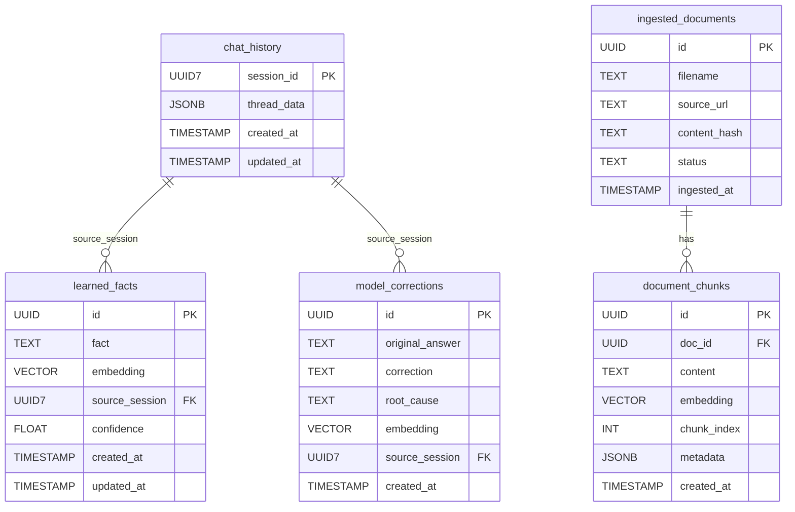

# Database Access Strategy

## Two-Pattern Rule

All database access in this codebase follows exactly two patterns. Never introduce a third.

| Purpose                           | Driver                  | Pattern                             | Where used                              |
| --------------------------------- | ----------------------- | ----------------------------------- | --------------------------------------- |
| pgvector cosine-similarity reads  | `asyncpg` pool          | `async with pool.acquire() as conn` | `rag_retrieval`, `memory_retrieval`     |
| Relational writes (INSERT/UPDATE) | SQLModel sync `Session` | `with Session(engine) as session`   | `ingestion_agent`, `memory_persistence` |

## Why Two Drivers

- **`asyncpg` is mandatory for pgvector reads.** `pgvector.asyncpg` registers a custom type codec (`register_vector`) on each connection. Without it, cosine-similarity queries (`<=>`) fail at the driver level. SQLAlchemy/psycopg cannot substitute here.
- **SQLModel sync `Session` is the established write pattern.** `db/models.py` defines all five table models (`LearnedFact`, `ModelCorrection`, `DocumentChunk`, etc.); Alembic uses those same models for migrations. Using SQLModel for writes keeps ORM model definitions and runtime writes in sync.

## Shared asyncpg Pool

The asyncpg pool singleton lives in `second_brain/db/pool.py` and is shared across all pgvector-reading nodes:

```python
# db/pool.py — single source of truth for the asyncpg pool
async def get_pgvector_pool(postgres_url: str) -> asyncpg.Pool: ...
async def shutdown_pgvector_pool() -> None: ...
```

Nodes import `get_pgvector_pool` directly — they do not create their own pools.

`shutdown_pgvector_pool` is imported by the app lifespan handler (not by individual nodes). `rag_retrieval.py`'s `shutdown_rag_pool()` is removed once the pool moves here.

## Write Pattern

Nodes that write to relational tables use the sync `Session` from `db/session.py`:

```python
from second_brain.db.session import engine
from sqlmodel import Session

with Session(engine) as session:
    session.add(LearnedFact(...))
    session.commit()
```

The sync call blocks the event loop momentarily. This is acceptable for write paths (1–3 rows per turn); do not use this pattern for bulk or high-frequency operations.

## LangGraph Checkpointing

A third connection (`psycopg_pool.AsyncConnectionPool`, psycopg3 driver) is managed exclusively by LangGraph's `AsyncPostgresSaver` in `graphs/query_graph.py`. This pool is **not** accessible to application code — it is LangGraph-internal. Do not extend it for application queries.

## Connection Count at Runtime

| Pool                  | Driver              | Owner                          |
| --------------------- | ------------------- | ------------------------------ |
| `asyncpg.Pool`        | asyncpg             | `db/pool.py` → shared by nodes |
| `Engine` (sync)       | psycopg2/SQLAlchemy | `db/session.py` → writes       |
| `AsyncConnectionPool` | psycopg3            | LangGraph `AsyncPostgresSaver` |

---

## Schema



### Embedding field notes

- `document_chunks.embedding` — encodes chunk text + contextual header; pgvector cosine similarity for RAG retrieval
- `learned_facts.embedding` — encodes the `fact` field; cosine similarity retrieves relevant memory per query
- `model_corrections.embedding` — encodes the `correction` field, **NOT** `original_answer`; similarity surfaces the correct answer, not the mistake

### Python ORM note

`DocumentChunk` uses Python attribute `chunk_metadata` mapped to SQL column `metadata` — avoids SQLAlchemy name conflict. Use `.chunk_metadata` in Python; use `metadata` in raw SQL.
