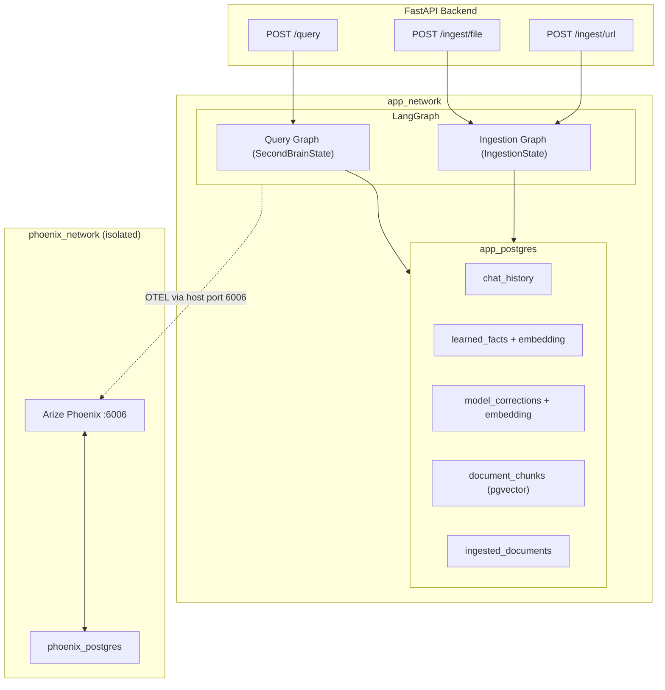
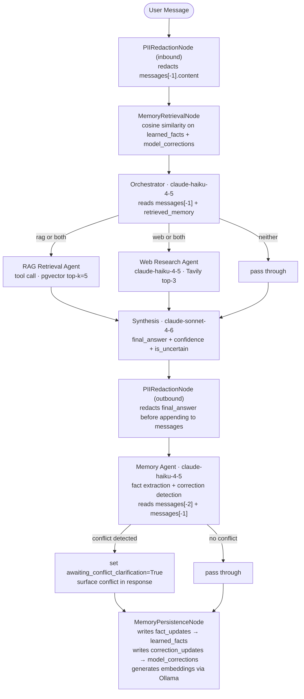
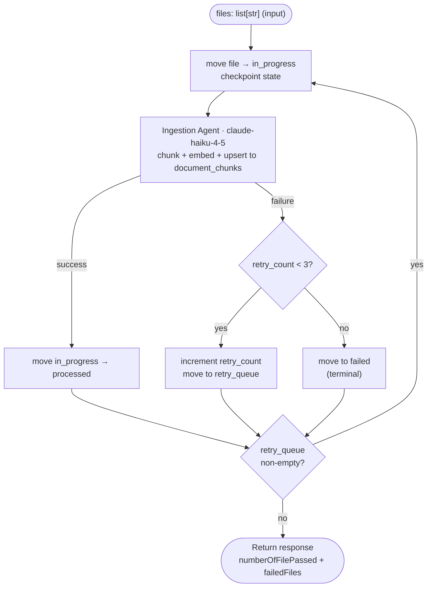
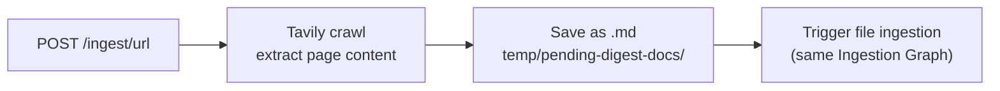

# Second Brain — System Design Spec

**Date:** 2026-06-16  
**Status:** Approved

---

## 1. Overview

A personal knowledge management system ("Second Brain") that ingests content from local markdown files and web URLs, stores it for semantic retrieval, and maintains persistent memory of conversations and learned facts. Built with LangGraph multi-agent orchestration, evaluated with RAGAS metrics.

---

## 2. API Surface

| Endpoint       | Method | Description                                                     |
| -------------- | ------ | --------------------------------------------------------------- |
| `/query`       | POST   | Chat with the Second Brain                                      |
| `/ingest/file` | POST   | Process pending markdown files from `temp/pending-digest-docs/` |
| `/ingest/url`  | POST   | Receive URL(s), crawl via Tavily, ingest as markdown            |

### `/query` request/response

```json
// Request
{ "message": "string", "sessionId": "UUID7 or null" }

// Response
{
  "answer": "string",
  "sessionId": "UUID7",
  "confidence": 0.85,
  "isUncertain": false,
  "conflictDetected": false,
  "conflictContext": []
}
```

`sessionId` is `null` for a new conversation; a UUID7 continues an existing session. The `sessionId` is the LangGraph `threadId` and the chat history key.

### `/ingest/file` response

```json
{
  "numberOfFilePassed": 9,
  "failedFiles": ["file-name-6.md", "file-name-9.md"]
}
```

Ingestion retries each file up to 3 times. Failed files (after exhausting retries) are moved to `temp/failed/`.

---

## 3. Tech Stack

| Component            | Technology                                                    |
| -------------------- | ------------------------------------------------------------- |
| Language             | Python                                                        |
| Web framework        | FastAPI                                                       |
| Agent orchestration  | LangGraph                                                     |
| Database             | PostgreSQL + pgvector (via Docker)                            |
| ORM + migrations     | SQLModel + Alembic                                            |
| Observability        | Arize Phoenix (OTEL)                                          |
| Embedding model      | `qwen3-embedding:0.6b` via Ollama (localhost:11434, dim=1024) |
| LLM — lightweight    | `claude-haiku-4-5`                                            |
| LLM — synthesis/eval | `claude-sonnet-4-6`                                           |
| Web search/crawl     | Tavily SDK                                                    |
| Containerisation     | Docker Compose                                                |

---

## 4. System Architecture

### High-Level Diagram



### Docker Networks

```yaml
app_network: [backend, app_postgres]
phoenix_network: [phoenix, phoenix_postgres]
```

The two networks are fully isolated — the backend has no access to `phoenix_network`. The backend exports OTEL traces to Phoenix via the **host port** (Phoenix exposes port 6006 on the host). This is intentional: in production, the backend must never have direct network access to Phoenix or its database.

> **Linux note:** On Linux Docker hosts, the backend service requires `extra_hosts: ["host.docker.internal:host-gateway"]` in `docker-compose.yml` to reach the host port. Docker Desktop (Mac/Windows) provides this automatically.

---

## 5. Query Graph — Agent Responsibilities

### Flow



### Agent Roles

| Agent                      | Model               | Responsibility                                                                                                                                                                                                                                                                                                                                                     |
| -------------------------- | ------------------- | ------------------------------------------------------------------------------------------------------------------------------------------------------------------------------------------------------------------------------------------------------------------------------------------------------------------------------------------------------------------ |
| **PIIRedactionNode (in)**  | rule-based          | Redacts PII from `messages[-1].content` using broad scope (names, emails, phones, addresses, IDs, financial, medical). Replaces with typed placeholders: `[NAME]`, `[EMAIL]`, `[PHONE]`, `[ADDRESS]`, `[ID]`, `[CARD]`, `[MEDICAL]`                                                                                                                                |
| **MemoryRetrievalNode**    | tool call           | Cosine similarity search on `learned_facts` and `model_corrections` tables, returns top-k items relevant to current query. Populates `retrieved_memory`                                                                                                                                                                                                            |
| **Orchestrator**           | `claude-haiku-4-5`  | Reads `messages[-1].content` + `retrieved_memory`. Routes to: `rag` / `web` / `both` / `neither`. Uses LangGraph `Send` for fan-out parallelism                                                                                                                                                                                                                    |
| **RAG Retrieval**          | tool call           | Embeds query via Ollama, cosine similarity search on `document_chunks` pgvector, returns top-k=5 chunks with scores                                                                                                                                                                                                                                                |
| **Web Research**           | `claude-haiku-4-5`  | Calls Tavily search API, returns top-3 results. Rate-limited                                                                                                                                                                                                                                                                                                       |
| **Synthesis**              | `claude-sonnet-4-6` | Combines `rag_results` + `web_results` + trimmed `messages` + `retrieved_memory` → `final_answer`. Emits `confidence` (0–1). Sets `is_uncertain=True` if confidence < 0.7. For `neither` routing: uses chat history + memory only, confidence floor 0.5                                                                                                            |
| **PIIRedactionNode (out)** | rule-based          | Redacts PII from `final_answer` before it is appended to `messages` and persisted to chat history                                                                                                                                                                                                                                                                  |
| **Memory Agent**           | `claude-haiku-4-5`  | (1) Extracts user facts from every message; (2) if `awaiting_correction=True` and message is a correction: extracts root cause → `correction_updates`; (3) if `awaiting_correction=True` and message is NOT a correction: resets to False and proceeds with fact extraction; (4) if `awaiting_conflict_clarification=True`: resolves conflict per user instruction |
| **MemoryPersistenceNode**  | tool call           | Reads `fact_updates` + `correction_updates` from state, generates embeddings via Ollama, writes to `learned_facts` / `model_corrections` tables                                                                                                                                                                                                                    |
| **Ingestion Agent**        | `claude-haiku-4-5`  | Chunks documents with hybrid strategy, generates contextual retrieval headers per chunk, embeds via Ollama, upserts to `document_chunks`                                                                                                                                                                                                                           |

### LangGraph State Definitions

```python
class RagResult(TypedDict):
    content: str
    score: float
    chunk_index: int
    metadata: dict          # {source, heading_path, content_type}

class WebResult(TypedDict):
    title: str
    url: str
    content: str

class MemoryItem(TypedDict):
    id: str
    fact: str
    confidence: float
    type: Literal["learned_fact", "model_correction"]

class FactUpdate(TypedDict):
    fact: str
    confidence: float
    conflicts_with: list[str]   # IDs of conflicting existing facts

class CorrectionUpdate(TypedDict):
    original_answer: str        # from messages[-2] (prior assistant response)
    correction: str
    root_cause: str

class SecondBrainState(TypedDict):
    session_id: str
    messages: list[BaseMessage]              # trimmed view sent to LLMs; full history in LangGraph checkpoint
    rag_results: list[RagResult]
    web_results: list[WebResult]
    retrieved_memory: list[MemoryItem]
    routing_decision: Literal["rag", "web", "both", "neither"]
    final_answer: str
    confidence: float
    is_uncertain: bool
    awaiting_correction: bool                # persisted across turns via LangGraph checkpointing
    awaiting_conflict_clarification: bool
    conflict_context: list[str]
    fact_updates: list[FactUpdate]
    correction_updates: list[CorrectionUpdate]
```

---

## 6. Ingestion Graph

### Flow



### Ingestion State

```python
class FailedFile(TypedDict):
    filename: str
    error: str
    retry_count: int

class IngestionState(TypedDict):
    files: list[str]                # original input queue (first-attempt files)
    in_progress: list[str]          # currently being processed (crash-safe tracking)
    processed: list[str]            # successfully ingested filenames
    retry_queue: list[FailedFile]   # failed files with retry_count < 3
    failed: list[FailedFile]        # terminal failures: retry_count >= 3
```

### URL Ingestion Flow



### File Folder Structure

```
temp/
  pending-digest-docs/   ← drop files here to ingest
  processed/             ← moved here after successful ingestion
  failed/                ← moved here after 3 retries exhausted
```

---

## 7. Document Chunking Strategy

### Hybrid Chunking

Split on structural boundaries first; apply token cap within large sections.

**Split order:** markdown headings (H1/H2/H3) → blank lines between paragraphs → sentence boundaries (if section exceeds max)

**Special cases:**

- Code fences are treated as atomic — never split inside a ` ``` ` block
- Header hierarchy (H1 > H2 > H3 path) is stored as chunk metadata for filtered retrieval

| Content Type              | Target Tokens | Max Tokens | Overlap |
| ------------------------- | ------------- | ---------- | ------- |
| Markdown articles / notes | 512           | 1024       | 64      |
| Meeting transcriptions    | 256           | 512        | 0       |
| Code fences               | atomic        | —          | —       |

### Contextual Retrieval Headers

Before embedding, each chunk gets a 50–100 token LLM-generated context header prepended:

> "This chunk is from [document title], section [H1 > H2], covering [topic summary]."

This significantly reduces retrieval failure rate (Anthropic research: 49–67% improvement).

### Document Deduplication

- Content hash (MD5) stored in `ingested_documents` table
- On ingestion: if hash matches existing record, skip the file
- Successful ingestion: file moved to `temp/processed/`

---

## 8. Memory System

### Learned Facts

- Auto-extracted from every user message when the user refers to themselves
- Embedded via Ollama before storing (enables semantic retrieval)
- Before storing: check for conflicts via cosine similarity against existing facts
  - If conflict detected: set `awaiting_conflict_clarification=True`, surface conflict in response, wait for user clarification
  - After clarification: add / modify / remove conflicting fact per user instruction

### Model Corrections

- Synthesis Agent sets `is_uncertain=True` when `confidence < 0.7`
- `awaiting_correction` is persisted across turns via LangGraph checkpointing
- When `awaiting_correction=True` and user sends a correction: Memory Agent reads `messages[-2]` (original answer) + `messages[-1]` (correction), extracts root cause, stores to `model_corrections`
- When `awaiting_correction=True` and user sends a non-correction: reset `awaiting_correction=False`, proceed with normal fact extraction

### PII Guardrail

Applied at two points in the query graph:

1. **Inbound**: `messages[-1].content` before it reaches any LLM node
2. **Outbound**: `final_answer` before it is appended to `messages` / persisted to chat history

**Scope:** broad — names, emails, phone numbers, physical addresses, national IDs, financial data (card numbers, bank accounts), medical terms  
**Action:** redact with typed placeholders — `[NAME]`, `[EMAIL]`, `[PHONE]`, `[ADDRESS]`, `[ID]`, `[CARD]`, `[MEDICAL]`

---

## 9. Database Schema

### Tables (app_postgres)

```sql
-- LangGraph session state (checkpoint store)
chat_history
  session_id    UUID7       PK
  thread_data   JSONB
  created_at    TIMESTAMP
  updated_at    TIMESTAMP

-- RAG document store
document_chunks
  id            UUID        PK
  doc_id        UUID        FK → ingested_documents.id
  content       TEXT        -- chunk text with contextual header prepended
  embedding     VECTOR(1024)
  chunk_index   INT
  metadata      JSONB       -- {source, heading_path, content_type, char_count}
  created_at    TIMESTAMP

-- Ingestion deduplication
ingested_documents
  id            UUID        PK
  filename      TEXT
  source_url    TEXT        -- null for local files
  content_hash  TEXT        -- MD5 of file content
  status        TEXT        -- 'processed' | 'failed'
  ingested_at   TIMESTAMP

-- Long-term memory: learned facts
learned_facts
  id            UUID        PK
  fact          TEXT        -- PII-scrubbed
  embedding     VECTOR(1024)
  source_session UUID7      FK → chat_history.session_id
  confidence    FLOAT
  created_at    TIMESTAMP
  updated_at    TIMESTAMP

-- Long-term memory: model corrections
model_corrections
  id            UUID        PK
  original_answer TEXT
  correction    TEXT
  root_cause    TEXT
  embedding     VECTOR(1024)  -- embeds `correction` field
  source_session UUID7      FK → chat_history.session_id
  created_at    TIMESTAMP
```

### ORM

**SQLModel + Alembic**

- SQLModel models serve as both DB table definitions and FastAPI request/response schemas
- Alembic handles all schema migrations
- pgvector supported via `pgvector-python` package

---

## 10. Observability (OTEL + Arize Phoenix)

Full distributed tracing across three levels per `/query` request:

- **LLM call level** — every prompt/completion, token counts, latency
- **Agent/node level** — which agents ran, order, duration, routing decision
- **Request level** — end-to-end trace from HTTP request to response

Phoenix stores trace data in `phoenix_postgres` (isolated, only accessible within `phoenix_network`).  
Backend exports traces to Phoenix via OTEL exporter targeting the **host port** — backend never joins `phoenix_network`.  
Phoenix UI exposed on host port 6006.

---

## 11. Evaluation (Eval-Driven Development)

### Eval Dataset

**Hybrid approach:** Claude generates ~100 Q&A pairs from ingested documents; user curates to ~30–50 high-quality pairs. Each pair includes: question, expected answer, expected source chunk(s).

### What to Evaluate

**Layer 1 — Retrieval quality:**

- Precision@k, Recall@k: did the right chunks come back?
- Measured via RAGAS `context_precision` and `context_recall`

**Layer 2 — Answer quality:**

- Faithfulness: is the answer grounded in retrieved context?
- Answer relevancy: does it actually answer the question?
- Measured via RAGAS with `claude-sonnet-4-6` as LLM judge

### Baseline Comparison

Same questions run through:

1. **No-RAG baseline** — Claude answering with no retrieval, only system prompt
2. **RAG pipeline** — full multi-agent system

Evidence requirement: RAGAS metrics must show measurable improvement of RAG over no-RAG baseline.

### Confidence Threshold Calibration

The `confidence < 0.7` threshold for flagging uncertainty is a starting point. During eval, measure precision/recall of uncertainty flags against human-labelled ground truth; adjust threshold based on that evidence.

### When to Run

Offline / on-demand via a script. Not part of CI.

---

## 12. Acceptance Criteria

| #     | Criterion                                                                                                                                                                        |
| ----- | -------------------------------------------------------------------------------------------------------------------------------------------------------------------------------- |
| AC-1  | After a turn that extracts a user fact, `learned_facts` DB table contains that fact with a valid embedding                                                                       |
| AC-2  | If `FactUpdate.conflicts_with` is non-empty after fact extraction, the API response includes a conflict notification and `awaiting_conflict_clarification=True` in session state |
| AC-3  | Given `awaiting_correction=True`, sending an unrelated new query resets `awaiting_correction=False` after the turn                                                               |
| AC-4  | Given `awaiting_correction=True` and a user correction, `model_corrections` table contains the root cause and correction with a valid embedding                                  |
| AC-5  | PII in user messages is redacted before reaching any LLM node                                                                                                                    |
| AC-6  | PII in `final_answer` is redacted before being persisted to `chat_history`                                                                                                       |
| AC-7  | A file in `temp/pending-digest-docs/` that fails ingestion is retried up to 3 times; on 3rd failure it moves to `temp/failed/`                                                   |
| AC-8  | A file already present in `ingested_documents` (matching content hash) is skipped on re-ingestion                                                                                |
| AC-9  | RAGAS `context_recall` and `answer_faithfulness` for the full RAG pipeline are measurably higher than the no-RAG baseline on the curated eval dataset                            |
| AC-10 | `/query` with a new `sessionId=null` creates a new LangGraph thread; subsequent requests with the returned UUID7 continue the same thread                                        |
